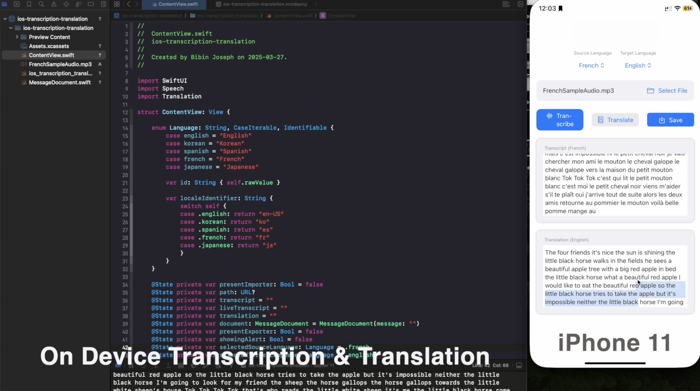

# iOS On-Device Transcription & Translation Demo

## 🎯 Overview

This project demonstrates an on-device Proof of Concept (POC) for **transcribing** audio files and **translating** the results into multiple languages using Apple’s native `Speech` and `Translation` frameworks. No external APIs are used, ensuring privacy and offline compatibility.

The UI is built using **SwiftUI**, and the app supports importing `.mp3` files, live transcription, language switching, and exporting transcripts.

---

## 📽 Demo

View Demo: [`Video`](./Demo)

---

## 🧠 Features

- ✅ On-device speech-to-text using `SFSpeechRecognizer`
- ✅ On-device translation using `TranslationSession`
- ✅ Multi Language Support
- ✅ Text export to `.txt` format
- ✅ SwiftUI-powered responsive UI

---

## 🧪 How to Use

1. Clone the repository.
2. Open `ios-transcription-translation.xcodeproj` in Xcode.
3. Build & run on a real device (translation support may not work on Simulator).
4. Select an audio file or let it auto-load `FrenchSampleAudio.mp3`.
5. Tap **Transcribe** to convert speech to text.
6. Tap **Translate** to convert the transcript into the selected target language.
7. Tap **Save** to export the result.

---
## ⚙ Requirements

- iOS 17+
- Xcode 15+
- Device with on-device speech & translation capabilities
- Microphone permission (for live audio input in extended builds)